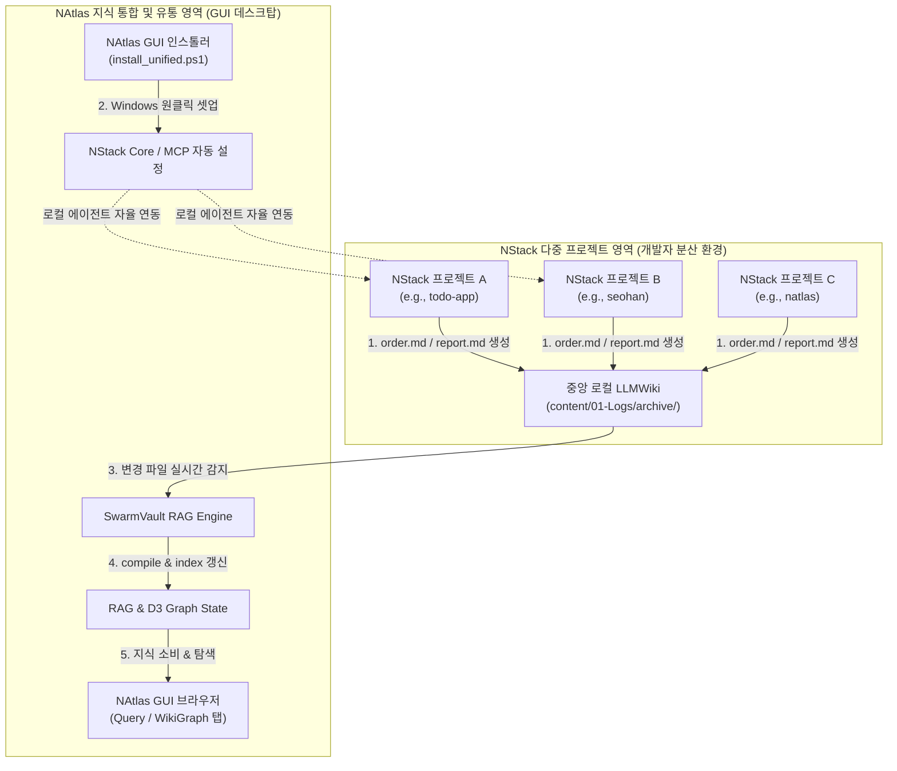

# NAtlas 아키텍처

## 전체 구조

```mermaid
flowchart TB
    subgraph App["Electron Desktop Application Container"]
        subgraph Frontend["React (Renderer Process)"]
            React["React SPA Components<br/>(Port 3000 in dev)"]
            State["Zustand (UI State)<br/>TanStack Query (Server State)"]
            React --- State
        end

        subgraph Backend["Electron Main Process Lifecycle"]
            Main["Electron Main Process<br/>(src/main/index.ts)"]
            Sidecar["sidecar.ts<br/>(Child Process Spawn & Guard)"]
            Main -->|Spawns & Monitors| Sidecar
        end
        
        React <-->|1. contextBridge / IPC| Main
    end

    subgraph SidecarService["Python FastAPI Sidecar (Port 18420)"]
        FastAPI["FastAPI Web Server<br/>(routers: swarmvault, settings, documents)"]
        SVControl["SwarmVault CLI wrapper"]
        FSControl["Local Filesystem Helpers"]
        FastAPI --- SVControl
        FastAPI --- FSControl
    end

    React <-->|2. HTTP REST API / SSE Streams<br/>(localhost:18420)| FastAPI
    Sidecar -->|Lifecycle SIGTERM / SIGKILL| FastAPI

    subgraph Storage["LLMWiki Root Storage (Local/Remote)"]
        Content["content/ (Markdown Archive)"]
        Graph["state/graph.json (D3 Graph JSON)"]
        Manifests["state/manifests/*.json (File Index Meta)"]
        Raw["raw/sources/ (Ingest Raw Source)"]
        Config["swarmvault.config.json (SwarmVault Config)"]
    end

    FastAPI <-->|3. SwarmVault CLI Operations & DB CRUD| Storage
```

### LLMWiki 디렉토리 구조

```
{LLMWIKI_ROOT}/                         ← Settings에서 설정하는 경로
├── swarmvault.config.json
├── content/
│   └── 01-Logs/
│       └── archive/
│           └── {project}/
│               └── {git_username}/
│                   └── {slug}/
│                       ├── order.md    (작업지시서)
│                       └── report.md   (완료보고서)
├── raw/
│   └── sources/                        (swarmvault ingest 결과)
└── state/
    ├── graph.json                       (swarmvault compile 결과)
    ├── compile-state.json
    └── manifests/
        └── {source-id}.json            (소스별 메타: repoRelativePath, hash 등)
```

---

## 빌드 도구: electron-vite

3개 Vite 번들러가 독립적으로 동작:

| 번들 대상 | 진입점 | 설명 |
|---|---|---|
| main | `src/main/index.ts` | Node.js 환경, externalizeDeps |
| preload | `src/preload/index.ts` | contextBridge API 정의 |
| renderer | `src/renderer/src/main.tsx` | React 앱, HMR 지원 |

개발 시: `electron-vite dev` → 3개 동시 실행
프로덕션: `electron-vite build` → `dist/` 에 각 번들 생성 → electron-builder 패키징

---

## preload.ts — contextBridge

renderer(React)는 보안상 Node.js API에 직접 접근 불가.
`preload/index.ts`가 `contextBridge.exposeInMainWorld`로 허용된 API만 노출.

```
renderer                  preload                     main
window.electron   →   contextBridge.expose   →   ipcMain.handle
.openFolderDialog()   'open-folder-dialog'      dialog.showOpenDialog()
```

```typescript
// preload/index.ts
contextBridge.exposeInMainWorld('electron', {
  openFolderDialog: () => ipcRenderer.invoke('open-folder-dialog'),
})

// main/index.ts
ipcMain.handle('open-folder-dialog', async () => {
  const { canceled, filePaths } = await dialog.showOpenDialog({ properties: ['openDirectory'] })
  return canceled ? null : filePaths[0]
})

// renderer (env.d.ts에 타입 선언)
const path = await window.electron.openFolderDialog()
```

**IPC 채널 목록** (preload ↔ main 반드시 일치):

| 채널명 | 방향 | 설명 |
|---|---|---|
| `open-folder-dialog` | renderer → main | 폴더 선택 다이얼로그 |

---

## 통신 방식 상세

### 1. React → FastAPI (HTTP, 주 통신)

TanStack Query로 래핑. 직접 fetch 사용:

```typescript
// lib/api.ts
const BASE = 'http://localhost:18420'
export const api = {
  getDocuments:        () => fetch(`${BASE}/documents`).then(r => r.json()),
  getSwarmVaultStatus: () => fetch(`${BASE}/swarmvault/status`).then(r => r.json()),
  getSettings:         () => fetch(`${BASE}/settings`).then(r => r.json()),
  saveSettings:        (body) => fetch(`${BASE}/settings`, { method: 'PUT', ... }).then(r => r.json()),
}
```

### 2. SSE 스트리밍 (SwarmVault update)

TanStack Query는 SSE를 지원하지 않음 → Fetch Stream API 직접 사용:

```typescript
const res = await fetch('http://localhost:18420/swarmvault/update', { method: 'POST' })
const reader = res.body!.getReader()
const decoder = new TextDecoder()

while (true) {
  const { done, value } = await reader.read()
  if (done) break
  const text = decoder.decode(value)
  for (const line of text.split('\n')) {
    if (!line.startsWith('data: ')) continue
    const log = JSON.parse(line.slice(6))  // { type, message }
    appendLog(log)
    if (log.type === 'done' || log.type === 'error') { setIsUpdating(false); return }
  }
}
```

FastAPI SSE — ingest 변경 파일 → compile 순서로 실행:
```python
async def stream(llmwiki_root: str):
    # 1. 변경/신규 파일 ingest (파일 1개씩)
    new_or_modified = get_new_or_modified_files(llmwiki_root)
    for f in new_or_modified:
        proc = await asyncio.create_subprocess_exec(
            'swarmvault', 'ingest', f,
            stdout=asyncio.subprocess.PIPE,
            stderr=asyncio.subprocess.STDOUT,
            cwd=llmwiki_root
        )
        async for line in proc.stdout:
            yield f'data: {json.dumps({"type": "log", "message": line.decode().rstrip()})}\n\n'

    # 2. compile
    proc = await asyncio.create_subprocess_exec(
        'swarmvault', 'compile',
        stdout=asyncio.subprocess.PIPE,
        stderr=asyncio.subprocess.STDOUT,
        cwd=llmwiki_root
    )
    async for line in proc.stdout:
        yield f'data: {json.dumps({"type": "log", "message": line.decode().rstrip()})}\n\n'

    yield f'data: {json.dumps({"type": "done", "message": "완료"})}\n\n'

return StreamingResponse(stream(settings.llmwiki_root), media_type='text/event-stream')
```

### 3. IPC (시스템 기능만)

폴더 선택 다이얼로그처럼 Electron API가 필요한 경우만 IPC 사용.
 나머지는 모두 FastAPI 직접 호출.

---

## Python Sidecar 생명주기

```
앱 시작
  └── sidecar.ts: spawn("python3", ["src/python/main.py", "--port", "18420"])
       └── GET /health 폴링 (500ms 간격, 최대 10초)
            ├── 성공 → React 렌더링 시작
            └── 10초 초과 → 사용자 알림 + 앱 종료

실행 중
  └── Python 프로세스 크래시 감지
       └── 재시작 (최대 3회)
            └── 3회 초과 → dialog.showErrorBox("백엔드 시작 실패")

앱 종료
  └── app.on('before-quit')
       └── Python 프로세스 SIGTERM
            └── 2초 대기 후 미종료 시 SIGKILL
```

---

## 상태 관리

### TanStack Query (서버 상태)

| queryKey | 갱신 주기 | 용도 |
|---|---|---|
| `['documents']` | 30초 자동 | Documents 탭 파일 목록 |
| `['swarmvault-status']` | 버튼 클릭 시 수동 | Settings 진단 |
| `['settings']` | stale 10초 | 설정값 |

### Zustand (UI 상태, `store/ui.ts`)

```typescript
interface UIStore {
  currentTab: 'documents' | 'update' | 'settings'
  setTab: (tab: UIStore['currentTab']) => void

  // Update 탭 전용
  isUpdating: boolean
  logs: LogLine[]
  lastRunAt: string | null
  setIsUpdating: (v: boolean) => void
  appendLog: (log: LogLine) => void
  clearLogs: () => void
  setLastRunAt: (t: string) => void
}
```

---

## 인덱싱 상태 판단 로직

Documents 탭의 `indexed` / `modified` / `new` 상태는 `state/manifests/` 기반으로 판단:

```python
import json, hashlib
from pathlib import Path

def get_file_status(llmwiki_root: str, rel_path: str) -> str:
    """
    rel_path: content/ 기준 상대경로
    예: "01-Logs/archive/memo/dev-a/memo-i1/order.md"
    """
    manifests_dir = Path(llmwiki_root) / "state" / "manifests"
    file_path = Path(llmwiki_root) / "content" / rel_path

    # 현재 파일 해시
    current_hash = hashlib.sha256(file_path.read_bytes()).hexdigest()

    # manifests에서 해당 파일 찾기 (repoRelativePath 기준)
    for manifest_file in manifests_dir.glob("*.json"):
        manifest = json.loads(manifest_file.read_text())
        if manifest.get("repoRelativePath", "").endswith(rel_path):
            stored_hash = manifest.get("sourceHash") or manifest.get("hash", "")
            return "indexed" if current_hash == stored_hash else "modified"

    return "new"
```

---

## 에러 핸들링 전략

| 상황 | 처리 방식 |
|---|---|
| FastAPI 연결 불가 (앱 시작 시) | 헬스체크 실패 → 앱 종료 + 에러 다이얼로그 |
| FastAPI 연결 불가 (실행 중) | TanStack Query isError → 배너 표시 |
| SwarmVault 미설치 | `/swarmvault/status` → ok: false → Settings에서 힌트 표시 |
| LLMWiki 경로 없음 | `/documents` → 500 → Documents 탭 에러 + Settings 이동 버튼 |
| swarmvault update 실패 | SSE `type: error` → 로그 빨간색 + 버튼 재활성화 |
| Python 크래시 | 자동 재시작 3회 → 실패 시 에러 다이얼로그 |

---

## 패키징 (Phase 3)

```
electron-builder
├── Mac: NAtlas.dmg   (Python pyinstaller 번들 내장)
└── Win: NAtlas-Setup.exe  (동일)
```

Phase 1-2는 개발자 환경(Python + Node.js 설치됨) 전제. Phase 3에서 번들 내장.

---

## NAtlas ↔ NStack 다중 프로젝트 연동 아키텍처

NAtlas와 NStack은 각각 **"지식의 통합 유통/RAG 탐색(Centralized Explorer)"**과 **"개별 개발 프로젝트의 분산 지식 생산(Decentralized Producer)"**의 역할을 담당하며, 상호 보완적인 E2E(End-to-End) 지식 선순환 고리를 형성합니다.

### 1. 연동 흐름 다이어그램



### 2. E2E 지식 파이프라인의 실시간 연동 원리

1. **분산된 지식의 생산 및 린팅 (NStack)**:
   * 개발자는 로컬 디바이스의 임의의 NStack 프로젝트 저장소에서 작업을 개별 진행합니다.
   * 작업 완료 시 에이전트(Antigravity 또는 Claude Code)와 협업하여 **3종 아티팩트(`order.md`, `report.md`, `wiki.md`)**를 생산하며, 로컬 pre-commit 훅과 정합성 린터(`verify_nstack_pipeline.py`)를 통해 무결성을 정적 검증받습니다.

2. **중앙 지식 아카이브로의 자동 이관**:
   * 검증이 완료된 아티팩트들은 각 개발자 프로젝트 내부에 고립되지 않고, 설정된 공통 경로인 **중앙 로컬 LLMWiki content/ 디렉토리**(`llmwiki/content/01-Logs/archive/{project}/{git_username}/{slug}/`)로 자동으로 안전하게 이관 및 복사됩니다.

3. **NAtlas 백엔드(FastAPI)의 실시간 컴파일**:
   * NAtlas 데스크탑 앱 백엔드는 중앙 로컬 LLMWiki 디렉토리(`llmwiki_root`)의 파일 변경 내역을 실시간 모니터링합니다.
   * 새로운 지식 문서가 이관되거나 기존 문서가 수정되면, `swarmvault.py` 백엔드 라우터가 즉시 `swarmvault ingest <file>` 및 `swarmvault compile`을 자동화하여 벡터 인덱스를 갱신합니다.

4. **전사 지식 탐색 및 소비**:
   * 컴파일 완료 즉시, 전사 직원은 NAtlas GUI 앱의 **Query 탭**을 통해 자연어 질문으로 새 지식을 탐색할 수 있으며, **WikiGraph 탭**에서 D3 물리 Force 그래프 형태로 다차원 지식 지도를 시각적으로 브라우징할 수 있습니다.

### 3. Windows 크로스플랫폼 GUI 온보딩 고도화

Windows 환경의 개발자들에게 복잡한 연동 환경을 Seamless하게 자동화하기 위해 다음 메커니즘을 지원합니다.

* **원클릭 통합 인스톨러 (`install_unified.ps1`)**: Windows 파워쉘 환경에서 Node 의존성, 격리 가상환경(.venv), Git 훅 연동, RAG 자가 진단까지의 9단계 설치 시퀀스를 단 한 번의 버튼 클릭으로 네이티브 처리하고 GUI 상에 실시간 시각화합니다.
* **Claude Desktop 글로벌 MCP 자가 치유**: `%APPDATA%\Claude\claude_desktop_config.json`을 자동 감지하여 SwarmVault MCP 설정을 주입해 줌으로써, AI 에이전트가 로컬 지식 RAG 탐색 도구들을 자율적으로 활용할 수 있도록 지원합니다.
