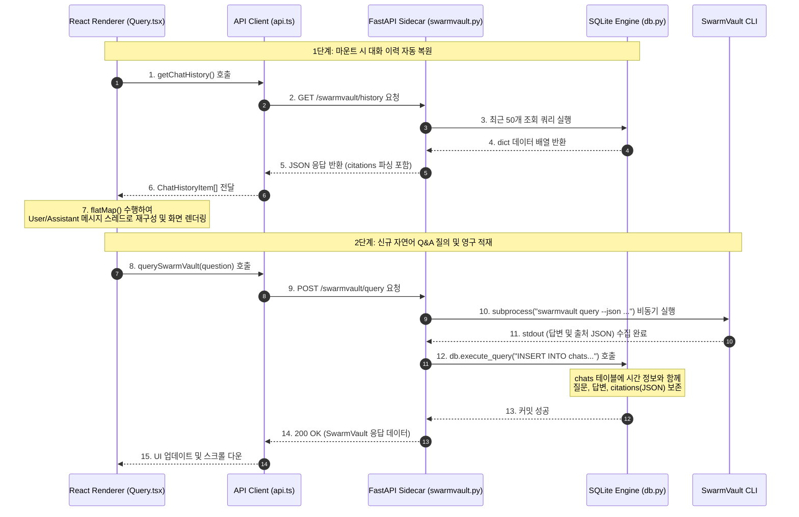
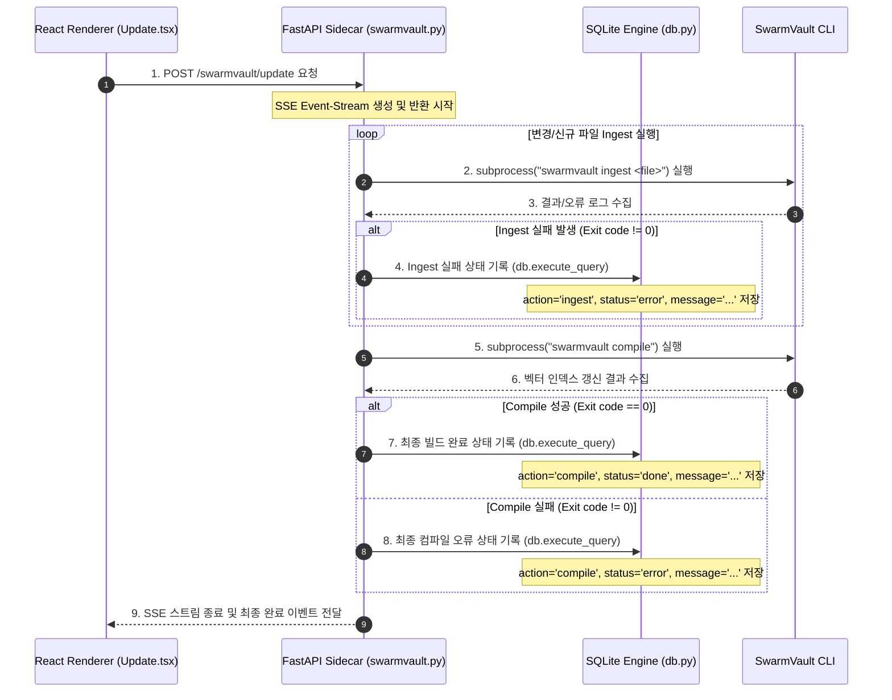

# NAtlas Phase 2 스펙 정의서: SQLite 로컬 DB 통합 및 영구 적재 고도화

이 문서는 NAtlas Phase 2의 핵심 마일스톤인 **SQLite 로컬 데이터베이스 통합 및 영구 적재 고도화**에 대한 기획 의도, 시스템 아키텍처, 데이터 플로우, 스키마 및 API 상세 사양을 정의합니다.

---

## 1. 기획 의도 (Background & Business Goal)

### 1.1. 도입 배경 및 문제점

- **메모리 휘발성**: NAtlas Phase 1(MVP)에서는 RAG 탐색 질문-답변 내역과 SwarmVault의 빌드/동기화 SSE(Server-Sent Events) 로그가 프론트엔드 React 컴포넌트의 로컬 상태(useState) 및 상태 관리 모듈(Zustand)로만 관리되었습니다.
- **사용자 경험(UX) 저하**: 이로 인해 사용자가 다른 탭으로 이동하거나 앱을 새로고침/재시작하면 소중한 과거 지식 탐색 맥락(Context)이 완전히 지워져, 동일한 질문을 다시 던져야만 하는 심각한 비효율이 발생하였습니다.
- **빌드 이력 추적 불가**: SwarmVault의 Ingest 및 Compile 동기화 빌드가 실패하더라도 과거 실패 기록이나 타임라인 로그를 확인할 수 없어, 어느 시점에 지식 베이스 동기화가 중단되었는지 원인 규명이 극히 곤란하였습니다.

### 1.2. 비즈니스 목적

- **지식 탐색 지속성 보장**: 데스크탑 로컬 디바이스에 독립적이고 영구적인 초경량 데이터베이스(SQLite)를 내장하여, 사용자가 과거에 탐색했던 자연어 질의 기록을 온전히 복원하고 지식 추적 생산성을 200% 이상 향상시킵니다.
- ** RAG 신뢰성 진단 지원**: 빌드 성패 로그를 영구 보존하여 지식베이스 인덱싱 문제 발생 시 타임라인 단위로 상태를 역추적하고 자가 진단할 수 있도록 지원합니다.
- **보안 및 규정 준수**: 클라우드가 아닌 전사 직원 각자의 **로컬 샌드박스 영역(`~/.natlas/natlas.db`)**에 격리하여 보존함으로써 전사 기밀 지식의 외부 누출 경로를 원천 차단합니다.

---

## 2. 요구사항 정의 (Key Specifications)

1. **로컬 데이터베이스 자동 마이그레이션**: 앱 구동 시 SQLite 데이터베이스가 자동으로 생성되고 스키마 버전이 일치하지 않거나 테이블이 없는 경우 무결하게 자동 생성(`init_db`)되어야 함.
2. **Q&A 질의 결과 영구 보존 (`chats`)**: SwarmVault RAG 질의 성공 시 질문, 마크다운 답변, 그리고 다중 참조 출처 목록(Citations, JSON Array 구조)이 원자적으로 적재되어야 함.
3. **대화 기록 복원 및 비우기**:
   - 사용자가 대화창에 진입할 때 **최근 50개**의 Q&A 목록을 시간 오름차순으로 완벽히 복원하여 끊김 없는 대화 스레드를 연출함.
   - [대화 지우기] 클릭 시 백엔드 DB의 해당 기록이 완전 청소되고 UI 상의 메시지 목록과 실시간 싱크가 이루어져야 함.
4. **SSE 빌드/동기화 로깅 (`build_logs`)**: SwarmVault Ingest 개별 파일 처리 오류 및 최종 Compile 성공/실패 시의 타임라인 로그와 타임스탬프를 DB에 자동 기록함.
5. **독립 인터페이스 보장**: SQLite 커넥션에 직접 접근하지 않고, 커넥션 풀링 및 예외를 안전하게 캡슐화한 백엔드 공통 인터페이스(`db.py`)를 통해서만 DB와 연동함.

---

## 3. 데이터 흐름 및 워크플로우 (Data Flows)

NAtlas 내부 레이어(React Renderer, FastAPI Backend, SwarmVault CLI, SQLite Engine) 간의 구체적인 제어 및 데이터 연동 흐름은 다음과 같습니다.

### 3.1. RAG 대화 복원 및 신규 저장 플로우

사용자가 앱을 켜거나 Query 탭으로 진입하여 질문을 던지고, 이를 백엔드에 백업 및 복원하는 흐름입니다.



### 3.2. SwarmVault SSE 빌드 이력 로깅 플로우

Update 탭에서 위키 데이터 소스를 빌드 및 벡터 데이터베이스로 컴파일할 때 상태를 추적 및 기록하는 플로우입니다.



---

## 4. 데이터베이스 스키마 설계 (Database Schema)

로컬 SQLite 데이터베이스 파일은 사용자 디렉터리 경로인 `~/.natlas/natlas.db`에 생성되며 아래의 두 가지 핵심 릴레이션으로 구성됩니다.

### 4.1. `chats` 테이블 (대화 히스토리 백업)

자연어 질문과 답변, 그리고 출처를 보존하기 위한 테이블입니다.

| 컬럼명           | 데이터 타입 | 제약 조건                   | 설명                                                                         |
| :--------------- | :---------- | :-------------------------- | :--------------------------------------------------------------------------- |
| **`id`**         | `INTEGER`   | `PRIMARY KEY AUTOINCREMENT` | 고유 식별자 (자동 증가 일련번호)                                             |
| **`question`**   | `TEXT`      | `NOT NULL`                  | 사용자가 입력한 자연어 질문 본문                                             |
| **`answer`**     | `TEXT`      | `NOT NULL`                  | SwarmVault RAG 엔진 또는 시스템이 생성한 마크다운 답변 본문                  |
| **`citations`**  | `TEXT`      | `DEFAULT NULL`              | 참조한 로컬 문서 파일 경로 배열 (`string[]`)을 JSON 문자열로 직렬화하여 적재 |
| **`created_at`** | `TIMESTAMP` | `DEFAULT CURRENT_TIMESTAMP` | 레코드 생성 시간 및 날짜 (ISO 8601 형식 변환 대상)                           |

### 4.2. `build_logs` 테이블 (빌드/컴파일 히스토리 타임라인)

위키 지식 동기화 과정의 타임라인을 보존하기 위한 로그 테이블입니다.

| 컬럼명            | 데이터 타입 | 제약 조건                   | 설명                                                 |
| :---------------- | :---------- | :-------------------------- | :--------------------------------------------------- |
| **`id`**          | `INTEGER`   | `PRIMARY KEY AUTOINCREMENT` | 고유 식별자 (자동 증가 일련번호)                     |
| **`action`**      | `TEXT`      | `NOT NULL`                  | 수행 작업 종류 (`ingest` 또는 `compile` 문자열 저장) |
| **`status`**      | `TEXT`      | `NOT NULL`                  | 수행 작업 상태 (`done` 또는 `error` 문자열 저장)     |
| **`log_message`** | `TEXT`      | `DEFAULT NULL`              | 에러 상세 메시지 또는 성공에 대한 요약 이력 텍스트   |
| **`created_at`**  | `TIMESTAMP` | `DEFAULT CURRENT_TIMESTAMP` | 레코드 생성 및 로그 기록 시각                        |

---

## 5. API 상세 사양 (REST API Specifications)

FastAPI 사이드카 백엔드가 외부에 노출하는 DB 연동용 웹 인터페이스 명세입니다.

### 5.1. `GET /swarmvault/history`

- **설명**: 최근에 수행된 Q&A 이력을 최대 50개까지 시간순(오름차순)으로 정렬하여 반환합니다.
- **Request Headers**: `Content-Type: application/json`
- **Response Body (200 OK)**:
  ```json
  [
    {
      "id": 1,
      "question": "NAtlas의 도입 목적이 무엇인가요?",
      "answer": "NAtlas는 전사 위키 문서 검색 및 SwarmVault RAG 탐색기...",
      "citations": ["content/01-Logs/system.md", "content/02-System/architecture.md"],
      "created_at": "2026-05-20 16:05:12"
    },
    {
      "id": 2,
      "question": "SQLite는 로컬 어디에 저장되나요?",
      "answer": "사용자 홈 디렉토리 하위인 `~/.natlas/natlas.db`에 저장됩니다.",
      "citations": [],
      "created_at": "2026-05-20 16:08:44"
    }
  ]
  ```

### 5.2. `DELETE /swarmvault/history`

- **설명**: 로컬 DB에 누적된 대화 히스토리 레코드를 모두 청소(DELETE)합니다.
- **Response Body (200 OK)**:
  ```json
  {
    "ok": true,
    "message": "대화 이력이 성공적으로 삭제되었습니다."
  }
  ```

### 5.3. `POST /swarmvault/query` (RAG 질의 & DB Ingestion)

- **설명**: 자연어 질문을 받아 SwarmVault를 호출하고 결과를 DB에 자동 적재 후 반환합니다.
- **Request Body**:
  ```json
  {
    "question": "SQLite 이력 적재 기능 스펙을 알려줘"
  }
  ```
- **Response Body (200 OK)**:
  ```json
  {
    "answer": "SQLite 이력 적재 기능은 chats 테이블에 기록을 저장하고...",
    "citations": ["content/03-Resources/phase2_sqlite.md"]
  }
  ```
- **DB Ingestion Side Effect**: 응답 직전에 `chats` 테이블에 새 튜플이 `commit=True` 처리되어 안전하게 추가됩니다.

---

## 6. 개발 및 구현 제약 규칙

1. **직접 접근 금지 (No Raw SQLite Connection in Routers)**
   - 백엔드 라우터(`/routers/*.py`)에서 `sqlite3.connect()`를 사용해 원시 커넥션을 맺어서는 안 됩니다. 반드시 `db.py`에 선언된 `db.execute_query()`만을 사용해 질의를 통제합니다.
2. **JSON 직렬화 준수 (Safe JSON Serialization)**
   - SQLite는 배열 타입을 기본 제공하지 않으므로, `citations` 리스트 데이터는 반드시 파이썬 내장 `json.dumps(citations)`를 통해 텍스트로 보존하고, 리딩 API(`GET /history`)에서 다시 `json.loads`로 복원해 주어야 합니다.
3. **메모리 보호 정책 (Max Capacity 50 Records)**
   - 로컬 디스크 및 메모리를 과도하게 점유하지 않도록 히스토리 복원은 항상 `LIMIT 50`으로 엄격히 상한을 고정하며, 이 상한 내에서 최신 대화 순으로 역조회하여 정렬합니다.
